# HRFlow RAG AI

HRFlow RAG AI is a full-stack HR operations platform that turns scattered HR documents into a structured, searchable, and action-oriented workflow system. It combines document intelligence, candidate parsing, JD matching, attendance issue detection, communication queues, HR case tracking, and AI-assisted email, letter, and interview-pack generation into one workspace-based dashboard.

The project is built as a portfolio-grade MVP to demonstrate practical AI automation in an internal business operations setting. Instead of being a generic chatbot wrapper, HRFlow focuses on end-to-end HR execution: upload documents, extract structured information, generate candidate profiles, match resumes to job descriptions, detect operational issues, create communication tasks, and drive actions from a central command center.

---

## Preview

### Dashboard Command Center

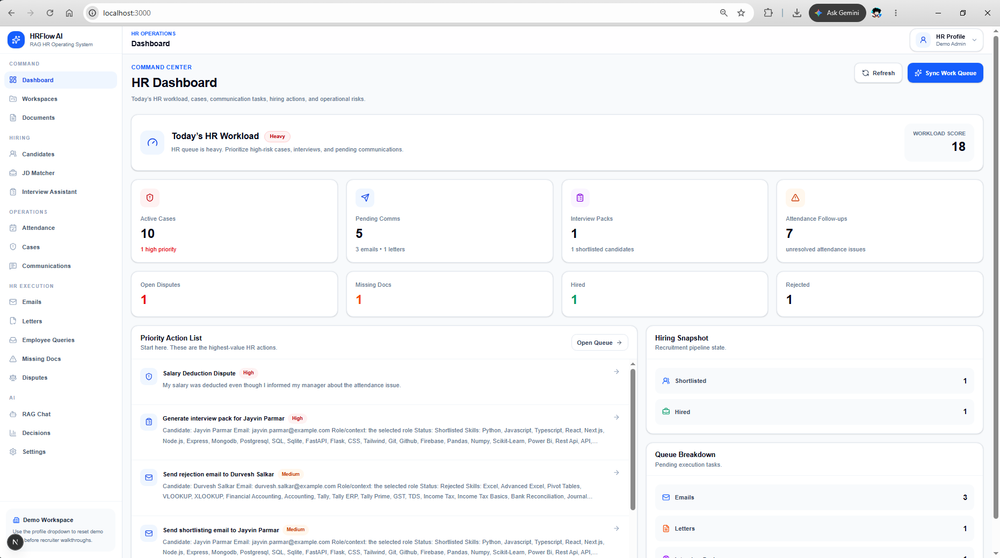

### Document Intelligence

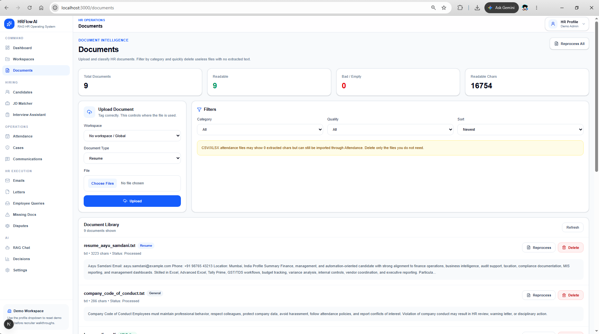

### Parsed Candidate Profiles

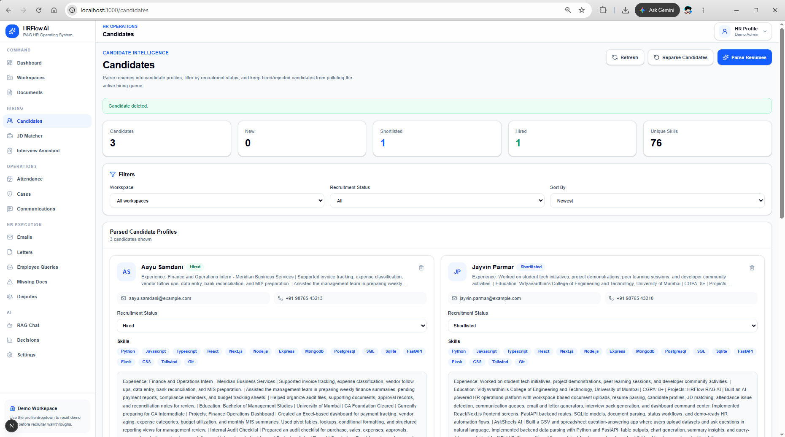

### JD Matching - Full Stack AI Engineer

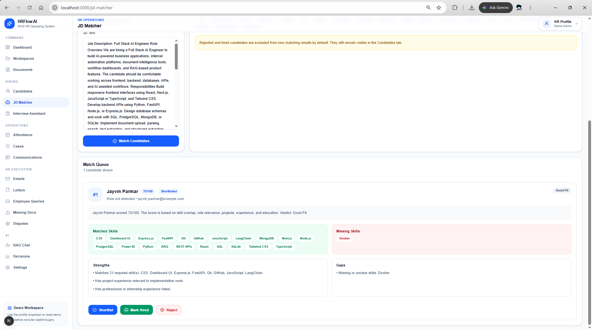

### JD Matching - Finance Automation

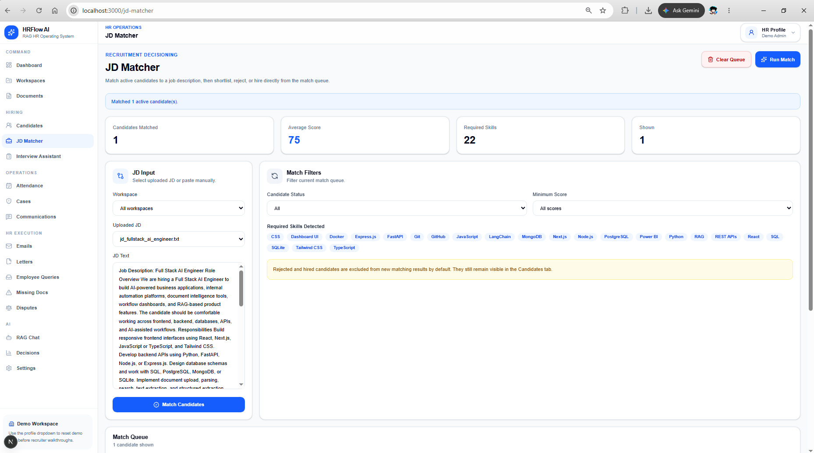

### Attendance Assistant

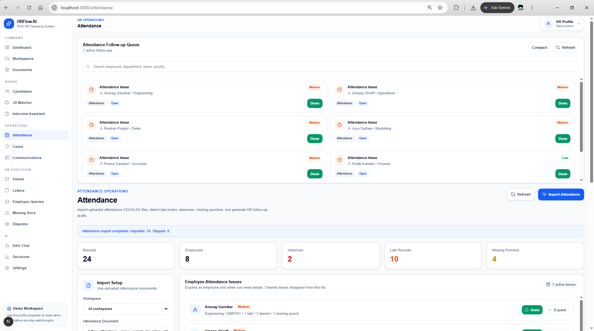

### Communications Queue

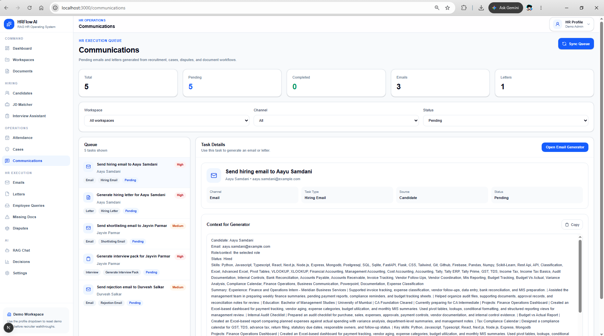

### Email Generator with Queue Autofill

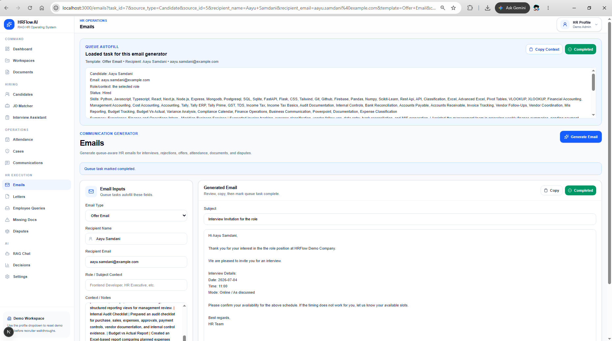

### Letter Generator with Queue Autofill

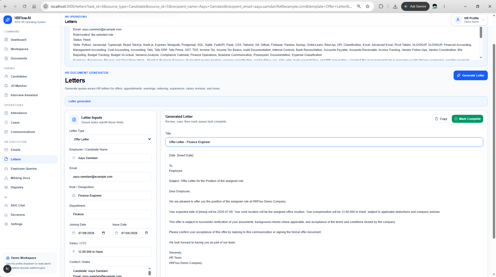

### Interview Pack Generator

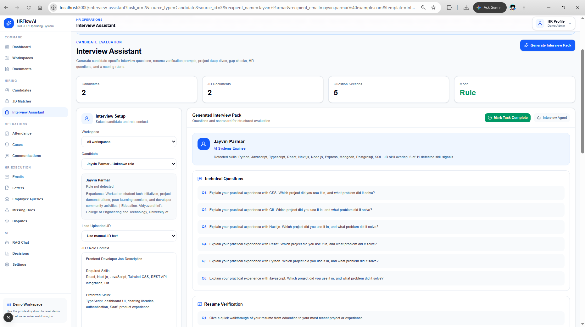

### HR Cases

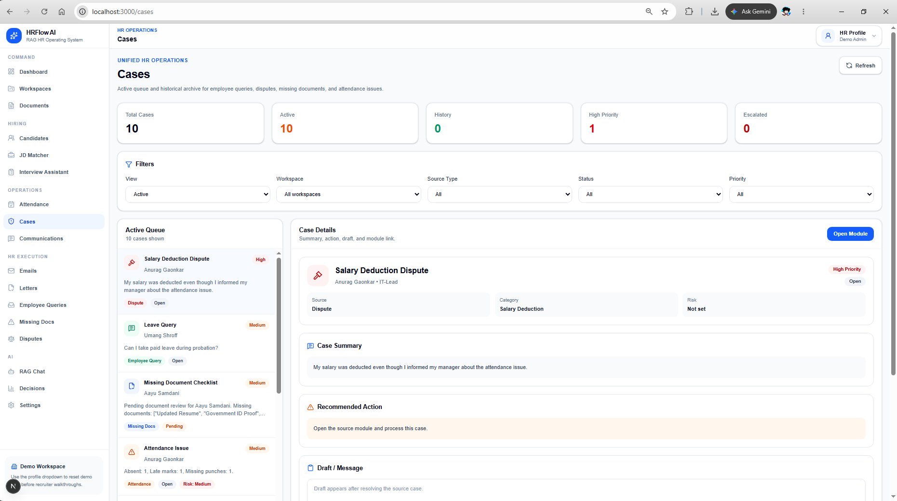

---

## Core Idea

HR teams often work across resumes, job descriptions, attendance sheets, missing documents, employee queries, disputes, emails, and offer letters. In many small and mid-sized teams, this work is still handled through spreadsheets, folders, manual follow-ups, and disconnected tools.

HRFlow RAG AI solves this by creating an internal HR command center where documents become structured workflows.

The system can:

- Upload and classify HR documents by workspace.
- Parse resumes into candidate profiles.
- Extract candidate skills, education, experience, projects, and contact details.
- Match candidates against job descriptions.
- Detect attendance irregularities from uploaded attendance files.
- Separate HR cases from communication tasks.
- Generate queue-aware emails, letters, and interview packs.
- Track pending and completed work through a dashboard.
- Keep hiring, attendance, and HR operations connected through one flow.

---

## Key Features

### Workspace-Based HR Operations

HRFlow supports workspace-level organization so documents, candidates, JDs, attendance files, and workflows can be grouped by context. This makes it suitable for separating departments, clients, hiring drives, or demo environments.

### Document Intelligence

The document module supports categorized uploads for:

- Resumes
- Job descriptions
- Attendance files
- HR policies
- Employee queries
- Disputes
- Onboarding documents
- General HR files

Documents are parsed, previewed, classified, and made available to downstream workflows.

### Multi-File Upload

The document upload workflow supports selecting and uploading multiple files together. Duplicate prevention is included at the frontend level using filename, document type, and workspace context, preventing repeated uploads during demos or repeated test runs.

### Resume Parsing

The resume parser extracts structured candidate data from uploaded resumes:

- Name
- Email
- Phone
- Skills
- Education
- Experience
- Projects
- Current role
- Summary

The parser supports both technical resumes and finance/accounting resumes, including skills such as React, FastAPI, RAG, LangChain, SQL, Excel, GST, TDS, Tally, MIS reporting, audit documentation, bank reconciliation, and finance operations.

### Candidate Pipeline

Parsed candidates can be managed through a recruitment workflow:

- New
- Shortlisted
- Rejected
- Hired

Candidate status changes automatically feed the communication queue. For example, shortlisted candidates generate interview and shortlisting tasks, rejected candidates generate rejection email tasks, and hired candidates generate offer/hiring communication tasks.

### JD Matching

The JD Matcher ranks candidates against a job description using extracted resume content and skill overlap. It supports both technical and non-technical job descriptions.

Example demo flows:

- Full Stack AI Engineer JD ranks AI/full-stack candidates higher.
- Finance Automation and Management Reporting JD ranks finance/accounting candidates higher.

### Attendance Assistant

The attendance assistant imports attendance spreadsheets and detects issues such as late arrivals, missing check-ins/check-outs, absence patterns, and follow-up needs.

Attendance issues can feed operational visibility through the dashboard and communication workflows.

### Communications Queue

HRFlow separates communication tasks from HR cases.

Communication tasks include:

- Shortlisting emails
- Rejection emails
- Hiring emails
- Offer/hiring letters
- Interview packs
- Attendance follow-up emails

Each task stores recipient data, suggested template, context, priority, and completion status.

### Queue-Aware Email Generator

The email generator supports multiple HR email types:

- Interview invite
- Shortlist email
- Rejection email
- Offer email
- Missing document request
- Attendance follow-up
- Policy response
- Dispute follow-up
- General HR email

When opened from the communications queue or dashboard, fields are deep-filled using task data.

### Queue-Aware Letter Generator

The letter generator supports common HR document types:

- Offer letter
- Appointment letter
- Experience letter
- Relieving letter
- Warning letter
- Salary revision letter
- Probation confirmation letter
- Leave response letter
- General HR letter

Queue tasks can auto-fill the recipient, template, and context.

### Interview Pack Generator

The interview assistant generates structured interview packs for selected candidates and job descriptions. It includes:

- Candidate summary
- Technical or role-specific questions
- Resume verification questions
- Project deep-dive questions
- HR questions
- Interview scorecard

Interview pack tasks can be marked completed after generation so the queue and dashboard stay updated.

### HR Cases

Cases are kept separate from communications. This makes the product cleaner and closer to real HR workflows.

Cases are intended for:

- Employee queries
- Disputes
- Missing documents
- Attendance issues
- Other operational HR issues

Communications are the execution layer; cases are the issue-tracking layer.

### Dashboard Command Center

The dashboard gives a high-level view of current HR workload:

- Active cases
- Pending communications
- Pending emails
- Pending letters
- Pending interview packs
- Attendance follow-ups
- Open disputes
- Missing documents
- Shortlisted candidates
- Hired candidates
- Rejected candidates
- Priority action list
- Workload score

The dashboard deep-links into emails, letters, and interview packs with queue context preserved.

---

## Tech Stack

### Frontend

- Next.js
- React
- Tailwind CSS
- Lucide React
- Axios-style API layer
- Client-side workflow state management
- Workspace-aware routing and filters

### Backend

- FastAPI
- Python
- SQLAlchemy
- SQLite
- Pydantic
- Uvicorn
- Pandas
- OpenPyXL
- PyMuPDF
- python-docx

### Core Backend Modules

- Document upload and parsing
- Resume parsing
- Candidate management
- JD matching
- Attendance import and analysis
- Communication queue generation
- Email draft generation
- Letter draft generation
- Interview pack generation
- Dashboard command center
- Case aggregation

### Data Layer

- SQLite database for local MVP persistence
- SQLAlchemy ORM models
- Workspace-linked records
- Candidate-document linking
- Communication task status tracking

---

## Architecture

HRFlow follows a modular full-stack architecture.

The frontend is organized by product surfaces:

- Dashboard
- Workspaces
- Documents
- Candidates
- JD Matcher
- Attendance
- Communications
- Emails
- Letters
- Interview Assistant
- Cases

The backend is organized around API routers and service modules:

- API routers handle HTTP contracts.
- Services handle parsing, matching, generation, and analysis logic.
- Models define persistent entities.
- Schemas define response contracts.

The central workflow is:

1. Upload documents.
2. Parse documents into structured records.
3. Convert records into candidates, attendance issues, cases, or communication tasks.
4. Use the dashboard and queues to act on pending work.
5. Generate HR outputs from task context.
6. Mark tasks or cases complete.

---

## Demo Flow

A strong demo flow is:

1. Open the dashboard command center.
2. Upload multiple resumes, job descriptions, and attendance files.
3. Parse resumes into candidate profiles.
4. Match candidates against a Full Stack AI Engineer JD.
5. Match finance candidates against a Finance Automation JD.
6. Shortlist, reject, and hire different candidates.
7. Sync the communications queue.
8. Open an email task and generate a deep-filled email.
9. Open a letter task and generate an offer letter.
10. Open an interview task and generate an interview pack.
11. Mark tasks complete.
12. Return to the dashboard and show updated workload.

---

## Why This Project Matters

This project demonstrates more than CRUD development. It shows the ability to design a business workflow system around real operational pain points.

HRFlow combines:

- Full-stack engineering
- Workflow automation
- Document processing
- Rule-based intelligence
- Applied AI product thinking
- Dashboard design
- Internal tools architecture
- HR operations understanding

The result is an MVP that feels like a practical internal SaaS product rather than a standalone toy project.

---

## Current MVP Status

Implemented:

- Workspace management
- Multi-file document upload
- Document classification
- Resume parsing
- Candidate management
- Candidate status workflow
- JD matching
- Attendance import and issue detection
- Communication task generation
- Email generator
- Letter generator
- Interview pack generator
- Dashboard command center
- HR case separation
- Duplicate upload blocking
- Queue task completion
- Dashboard deep-fill links

---

## Future Scope

### AI/RAG Enhancements

- Add vector search over uploaded HR documents.
- Add workspace-level RAG chat for HR policies, resumes, JDs, and attendance data.
- Use embeddings for semantic JD matching instead of keyword-heavy matching.
- Add explainable match scoring with evidence snippets from resumes.

### Workflow Automation

- Add automated task rules for different HR events.
- Add SLA timers for pending HR cases.
- Add escalation logic for high-priority disputes and attendance issues.
- Add recurring compliance reminders.

### Communication Integrations

- Gmail integration for draft creation.
- Email sending workflow with approval states.
- Calendar integration for interview scheduling.
- Slack or Teams notifications for pending HR actions.

### Authentication and Roles

- Add login and role-based access.
- Separate HR admin, recruiter, manager, and employee views.
- Add audit logs for sensitive HR actions.

### Production Data Layer

- Move from SQLite to PostgreSQL.
- Add migrations with Alembic.
- Add file storage through S3-compatible object storage.
- Add background processing for large document batches.

### Analytics

- Hiring funnel analytics.
- Candidate source quality analytics.
- Attendance trend analysis.
- Case resolution time tracking.
- HR workload forecasting.

### Document Generation

- Export letters as PDF or DOCX.
- Add branded templates.
- Add approval workflow before finalizing HR documents.
- Add version history for generated outputs.

---

## Repository Structure

```txt
hrflow-rag-ai/
├── backend/
│   ├── app/
│   │   ├── api/
│   │   ├── db/
│   │   ├── models/
│   │   ├── schemas/
│   │   └── services/
│   ├── uploads/
│   └── run.py
├── frontend/
│   ├── src/
│   │   ├── api/
│   │   ├── app/
│   │   ├── components/
│   │   └── lib/
│   └── package.json
├── screenshots/
└── README.md